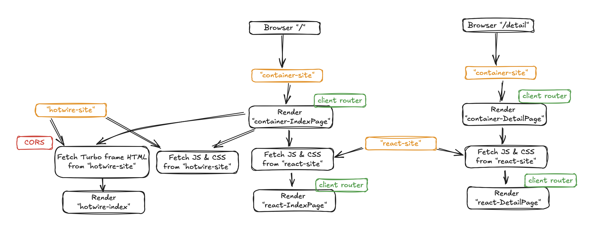

# Micro Frontend Study

This is a website for studying Micro Frontends. It is based on the following article, but much more simplified. 

[Micro Frontends are described in this martinfowler.com article](https://martinfowler.com/articles/micro-frontends.html#TheExampleInDetail)

## What is a Micro Frontend

In general, micro frontends are defined by the following characteristics.

* The frontend is divided into separate micro frontends which handle individual features.
* Each micro frontend is independently developed, tested and deployed.
* Each feature is managed by a single vertical team. There should be no cross-cutting teams.
* There should be a container application that provides common headers, footers, authentication, navigation, etc.
* The container application should read in each micro frontend and determine what is shown and when.
* Some tools are module federation (webpack), libraries like Single-SPA, Web Components, or iframes.

Some resources
* [micro-frontends.org](https://micro-frontends.org)
* [martinfowler.com](https://martinfowler.com/articles/micro-frontends.html)
* [The Truth Behind Micro Frontends: Insights from Real Case Studies](https://www.bitovi.com/blog/the-truth-behind-micro-frontends-insights-from-real-case-studies)

There are many examples that claim to be Micro frontends but do not satisfy the first requirement that each micro frontend must be independently developed and deployed.
Others do not have a container application and are simply different applications behind a single host name.
Instead of accommodating these approaches and potentially diluting the argument for micro frontends,
we have taken a narrower view.

The [martinfowler.com article](https://martinfowler.com/articles/micro-frontends.html) by Cam Jackson sums it up nicely.

> In short, micro frontends are all about slicing up big and scary things into smaller, more manageable pieces, and then being explicit about the dependencies between them. Our technology choices, our codebases, our teams, and our release processes should all be able to operate and evolve independently of each other, without excessive coordination.

If the methodology does not achieve these benefits, then it is not a micro frontend.

## Gist of what we did

[The martinfowler.com article](https://martinfowler.com/articles/micro-frontends.html#IntegrationApproaches) describes the general structure of a micro frontend and lists common methods to create these.

This project follows the "run-time integration with JavaScript" approach and consists of three micro frontends.

1. "react-root" is where everything comes together. This is the page that the user will see and is called the **container application** in the above article. This page pulls in the frontends from the two other parts.
2. "react side" is a micro frontend written in React.
3. "hotwire side" is a micro frontend written in Hotwire.

## How to get it running

1. CD into the "root-react" project. Build it with `npm run build`. Then start the server with `npm run preview`. Leave this running.
2. CD into the "react-site" project. Build it with `npm run build`. Then start the server with `npm run preview`. Leave this running. Alternatively, if you are only running the "react-site" project during development, then you can run `npm run dev` and view this micro frontend in isolation. 
3. CD into the "hotwire-side" project. Build it with `npm run build`. Then start the server with `npm run preview`. Leave this running. Alternatively, if you are only running the "hotwire-side" project during development, then you can run `npm run dev` and view this micro frontend in isolation.
4. Access the "react-root" project. This should pull in files from the "react-side", "hotwire-side" and display the page. 

Notes: 
For integration testing where you load in the "react-side" and "hotwire-side" into the "react-root"
project, you must use production builds of the "react-site" and "hotwire-side".
In other words, the development server versions of "react-side" and "hotwire-side"
can be used for independent development of each micro-frontend,
but they can't be used in integration.
Technically, this is because Vite's development server does not build manifest files that the "react-root"
container application can read.

## Setup notes

For convenience, we have included `.env` files into the repository. Override environment variables in deployment as necessary.

## Demo

1. ["root-react" container application](https://microfrontend-root-react.vercel.app)
2. Micro-frontends: ["react-site"](https://microfrontend-react-site.vercel.app), ["hotwire-side](https://microfrontend-hotwire-side.vercel.app)

## Code

[GitHub](https://github.com/naofumi/microfrontend-study)

## How it works

### React side

The React side builds a JavaScript file that contains the "react-side" application.

When this JavaScript is loaded in the "container" application, 
the `App` component is rendered inside any elements with a `data-root` attribute. 
CSS is also loaded from the "react-side" application.

### Hotwire side

Unlike React, which uses JavaScript to render HTML, Hotwire requires both HTML and JavaScript files (and of course CSS). We need to pull in both. 

The container application will pull in HTML from the "hotwire-side" application using `turbo-frames`.
Cross orgin Turbo Frame requests require CORS settings, which are provided in `vercel.json` for Vercel deployment.
The container application will also pull in the JavaScript and CSS from the "hotwire-side" application. 

Both Turbo and Stimulus assume that they are run under the global scope.
If we have two micro-frontends that both pull in Stimulus independently,
then we could run into cases where Stimulus actions are being called more than once.
To prevent this, both Turbo and Stimulus should not be built into Vite bundles.
Instead, they should be hosted on an asset server and imported.

### Root: Container app

This container application will pull in the files required for showing the "react-side"
and the "hotwire-side" micro-frontends.
It will first read the manifest files from the respective frontends
and request the latest file versions with digests in their filenames. 

The container application has a simple client-side router to switch between pages depending on the browser URL.
Each page will pull in the micro-frontends that it needs.

### Client-side routing

This is loosely based on the [example on martinfowler.com](https://martinfowler.com/articles/micro-frontends.html#TheExampleInDetail).

Key points:

* We turn off Turbo because this will interfere with routing. We will do page transitions with a full-page reload ("hard navigation").
* We need two routers
   * On the container application side, we need to change the page layout when the route changes. The first router, therefore, is in the container application. In the current case, the "/detail" path should just show the "react-site" and not show the "hotwire-site". We also change the page heading.
   * The container application does not manage the state of the "react-site". It is up to the "react-site" to show the appropriate page for the "/detail" path.
   * The "react-site" application has a second router. It looks up the current URL and shows the page for this path.
   * In addition, the container application can send props to the "react-site".
   * With the "hotwire-side" application, the container application sends a Turbo Frame request specific to the page that is being displayed. Basic static-site routing is done on the "hotwire-side" server.

### State management

The current application shares two global states.

* The URL
* For the "react-side", additional state can be sent in with the `data-props` attribute.
* For the "hotwire-side", additional state information is sent in with the Turbo Frame request URL.

## Main differences compared to the article

* We don't use React Router but use our own elementary client-side router. Our solution only works with hard-navigation (a full page reload for each page transition) and becomes much simpler.
* We don't have to worry about unmounting since we only do hard-navigation.

## Handling layout shift

The micro-frontend architecture loads content from various locations which will each arrive independently.
This will cause layout shift,
where newly arriving content will push existing elements out of where the new element should be placed.

Layout shift tends to make a website look fidgety and cheap.
To partially mitigate this, we have put in page layout animations so that the early layouts will not be visible.
